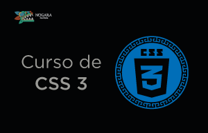

### Hi there 👋

### I have a course platform [nogara.dev](https://nogara.dev/courses/)

### Languages and Tools

  &nbsp;
  &nbsp;
&nbsp;
&nbsp;
&nbsp;
  &nbsp;

  &nbsp;
  &nbsp;
  &nbsp;

 
  &nbsp;

  &nbsp;

  &nbsp;
  

### Top Languages

