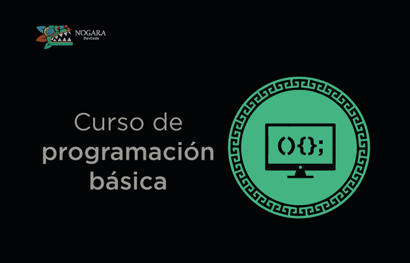

### Hi!! I'm Caress 👋

### I'm a Web Developer with 6+ years of experience

### I created two technical interview guides
- [Guía para entrevistas tecnicas como Ingeniero de software](https://github.com/DevCaress/guia-entrevistas-de-programacion)
- [Todo acerca de Javascript](https://github.com/DevCaress/todo-acerca-de-js)

### I have 3 courses on Youtube

### I also create content on social networks about programming, trends, new technologies, etc, etc...

### Languages and Tools

  &nbsp;
  &nbsp;
  &nbsp;
    &nbsp;
    &nbsp;
  &nbsp;
  &nbsp;
  &nbsp;
  &nbsp;
  &nbsp;
  &nbsp;
  &nbsp;
  &nbsp;
  &nbsp;
  &nbsp;
  &nbsp;
  

### Top Languages

